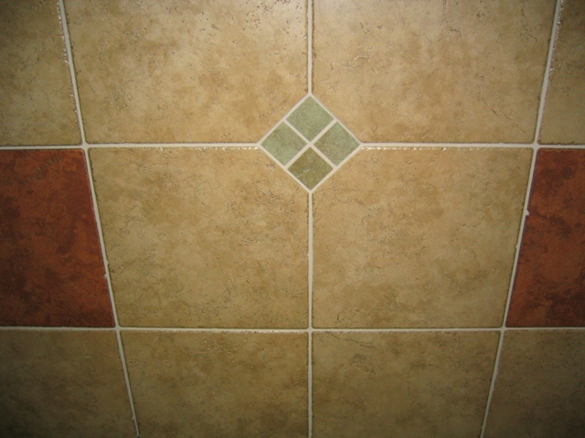

# HW1: Projective Geometry and Homography

## Instructions
* Late Submission Policy: See the late submission policy [here](https://geometric3d.github.io/pages/assignments/hw0.html).
* Submitting your work: Check the instructions for submission [here](https://geometric3d.github.io/pages/assignments/hw0.html).
* There are `5` questions in this assignment, where the last `2` are bonus questions. Make sure you follow the instructions and submit the answers as required.

## Q1: Affine Rectification (30 points)
Your goal in this question is to generate affinely correct warps for images that are captured through perspective cameras (assume pinhole camera model), with annotations of at least 2 pairs of parallel lines.

**Dataset Preparation**
 1. Find (or capture) `2` images. Ideally capture images that have sufficient perspective. Check the following example:

    | Good Input  | Bad Input |
    | ----------- | ----------- |
    |    |  |

  * Run your code on at least `3` images provided in the `data/q1` folder as well as *on the images you captured* (`5` images in total).

**Submission**
1. Input Images
2. Output Images: Rectified images and intermediate images with color coded annotation that you used. See the following figures:

    | Input Image | Annotated parallel lines on input image | Affine-Rectified Image |
    | ----------- | ----------- | ----------- |
    |    |  |    |

3. Evaluate Angles (more precisely, the cosines) of at least another 2 pairs of parallel lines before and after rectification. This will show how far from 1 the cosines are in the original image and how close to correct the final affine rectification is.

    | Before      | After |
    | ----------- | ----------- |
    | 0.7274    | 0.9979    |
    | 0.9998     | 0.9998    |

    | Test lines on Input Image     | Test lines on Affine-Rectified Image |
    | ----------- | ----------- |
    |   |  |

4. Brief description of your implementation (i.e., the algorithm followed with relevant equations and what annotations were used).

## Q2: Metric Rectification (40 points)
Your goal in this question is to generate metrically correct warps for images that are captured through perspective cameras (assume pinhole camera model), with annotations of at least 2 pairs of perpendicular lines, based on your result from Q1.

**Dataset Preparation**
 1. Find (or capture) `2` images. Ideally capture images that have sufficient perspective.
 2. Run your code on at least `3` images provided in the `data/q1` folder as well as *on the images you captured* (`5` images in total).

**Submission**
1. Input Images
2. Output Images: Rectified images and intermediate images with color coded annotation that you used. See the following figures:

    | Input Image | Annotated perpendicular lines on input image | Annotated perpendicular lines on Affine-Rectified Image | Rectified Image |
    | ----------- | ----------- | ----------- | --------- |
    |     |    |  |  |

3. Evaluate Angles (more precisely, the cosines) of at least another 2 pairs of perpendicular lines before and after rectification. This will show how far from 0 the cosines are in the original image and how close to correct the final metric rectification is. Check the following Table and Figure as an example:

    | Before      | After |
    | ----------- | ----------- |
    | -0.15073    | -0.00624    |
    | 0.10344     | 0.004659    |

    | Test lines on Input Image     | Test lines on Metric-Rectified Image |
    | ----------- | ----------- |
    |   |  |
4. Brief description of your implementation (i.e., the algorithm followed with relevant equations and what annotations were used).

## Q3: Planar Homography from Point Correspondences (30 points)
Your goal in this question is to estimate homographies between two images using point correspondences.

**Dataset Preparation**
 1. Find (or capture) `1` pair of images. The image pair should contain a "normal" image with no perspective effects, and an image with perspective effect. The goal is to apply an homography to the normal image to place it on top of the other image. Check the following example:

    | Normal Image | Perspective Image |
    | ----------- | ----------- |
    |    |   |
 2. Run your code on the pair of images provided in the `data/q3` folder as well as `1` additional pair of images that you captured. 

**Submission**
1. Input Images
2. Output Images: Warped images and intermediate images with annotation that you used (i.e., corners/point correspondences). See the following figures:

    | Normal Image | Perspective Image | Annotated corners in Perspective Image | Warped and Overlaid Image |
    | ----------- | ----------- | ----------- | ----------- |
    |    |   |    |  |
3. Biref description of your implementation (i.e., the algorithm followed with relevant equations and what annotations were used).

## Q4: Bonus 1 (10 points)
In Q2, we generate metrically correct warps of images with annotations of 2 pairs of perpendicular lines based on the result from Q1. In this question, the goal is to metric-rectify the image directly from at least 5 pairs of perpendicular lines. Note you can use more than 5 pairs to get more accurate results.

**Dataset Preparation**
 1. Find (or capture) `2` images. Ideally capture images that have sufficient perspective.
 2. Run your code on at least `3` images provided in the `data/q1` folder as well as *on the images you captured* (`5` images in total).

**Submission**
1. Input Images
2. Output Images: Rectified images and intermediate images with color coded annotation that you used. Annotate the lines that were used. See the following figure:
    | Input Image | Annotated perpendicular lines | Rectified Image |
    | ----------- | ----------- | ----------- |
    |     |    |   |
    
3. Angles (more precisely, the cosines) of at least 3 pairs of perpendicular lines before and after rectification.
4. Biref description of your implementation.

## Q5: Bonus 2 (10 points)
Try to be creative and do something fun!

For example, in Q3, we attempt to overlay a normal image on top of an image with perspective effect. You can try to overlay multiple ($\ge 3$) normal images on top of the image with perspective effect:

 | Example output | 
 | ----------- | 
 |   | 

<!-- **Dataset Preparation**
 1. Find (or capture) `1` image with perspective effect, and at least `3` "normal" images. Run your code on this set of images.  -->
 
**Submission**
 1. Input Images
 2. Output Images.
 3. Brief description of your implementation.

## What you can *not* do
* Download any code.
* Use any measurement in the scene provided apriori. (The only information available to the algorithm is the input image, and the annotations)
* Use any predefined routines except linear algebra functions, image interpolation, and image warping.
  
## Tips
* It is a good idea to `assert` with sanity checks regularly during debugging.
* Normalize point and line coordinates.
* Pick the parallel and perpendicular lines carefully.
* Process the transformation matrix properly before the final warping. (e.g., scale, translation, etc.)
* Remember that transformations are estimated up to scale, and that you are dealing with Projective Geometry.
* You *may not* use predefined routine to directly compute homography (e.g. `cv2.findHomography`). However, you *may* use predefined linear algebra/image interpolation libraries (e.g. `np.linalg`, `cv2.warpPerspective`). If you are unsure about what may or may not be used, don't hesitate to ask on Piazza.
* We provide some utility functions in `utils.py` for reference. Feel free to use it as you like.
* **Start Early and Have Fun!**
