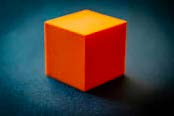

# HW2: Single-view Reconstruction
## Updates
* 10/03: Reference annotations released for q2a, q2b & q3. 

  Explanation of format and example code for visualization can be found in [annotations.py](https://github.com/geometric3d/assignment2/blob/master/annotations.py). It's not mandatory to use the reference annotations; you may use your annotations instead.

## Instructions
* Late Submission Policy: See the late submission policy [here](https://geometric3d.github.io/pages/assignments/hw0.html).
* Submitting your work: Check the instructions for submission [here](https://geometric3d.github.io/pages/assignments/hw0.html).
* There are `3` questions in this assignment. Make sure you follow the instructions and submit the answers as required.

## Q1:  Camera matrix `P` from 2D-3D correspondences (30 points)
In this question, your goal is to compute `P` from 2D-3D point correspondences.

### (a) Stanford Bunny (15 points)
We provide a picture of stanford bunny `data/q1/bunny.jpeg` and 2D-3D point correspondences in `data/q1/bunny.txt`. The text file contains multiple rows. Each row represents a pair of 2D-3D correspondences, where the first 2 numbers are the 2D coordinates on the image while the next 3 numbers are the corresponding 3D coordinates.

  | Input Image  | Annotated 2D points |
  | ----------- | ----------- | 
  |    |  | 

**Instructions**
  1. Compute the camera matrix `P` using the provided 2D-3D correspondences.
  2. We provide a set of 3D surface points in `data/q1/bunny_pts.npy`. Project these points to the image using your calculated `P`. See the example below.
  3. We provide the 12 edges of the bounding box in `data/q1/bunny_bd.npy`. Each line contains 6 numbers, where every 3 numbers denote 1 point. Project these points to the image and draw the cuboid. See the example below.

  | Surface Points  | Bounding Box |
  | ----------- | ----------- | 
  |    |  | 

### (b) Cuboid (15 points)
**Instructions**
  1. Find (or capture) 1 image of a cuboid. Come up with a 3D coordinate system (by measuring relative dimensions of the cuboid) and annotate 6 pairs of point correspondences.
  2. Compute the camera matrix `P` using your annotated 2D-3D correspondences.
  3. Draw the edges of the cuboid using your calculated `P` or do something fun!

  | Input Image  | Annotated 2D points | Example Result |
  | ----------- | ----------- | ----------- | 
  |    |  |  

## Q2: Camera calibration `K` from annotations (40 points + 10 points bonus)
### (a) Camera calibration from vanishing points (20 points)
In this question, your goal is to compute `K` from a triad of orthogonal vanishing points, assuming that the camera has zero skew, and that the pixels are square. 

**Dataset**
  1. Run your code on `data/q2a.png`. Annotate 3 pairs of parallel lines that are orthogonal to each other.

**Submission**
  1. Output plots of the vanishing points and the principal point. Also include visualizations of the annotations that you used. See the following figures:
  
  | Input Image  | Annotated Parallel Lines | Vanishing points and principal point |
  | ----------- | ----------- | ----------- |
  |    |  |  |
    
  2. Report `K` for the input image.
  3. Brief description of your implementation (i.e., the algorithm followed with relevant equations).
  
### (b) Camera calibration from metric planes  (20 points)
In this question, your goal is to compute `K` from image of three squares. Different from (a), you will not make any additional assumption on `K` (except that it is a projective camera). 

**Dataset**
  1. Run your code on `data/q2b.png`. Annotate 3 squares in the image.

**Submission**
  1. Visualizations of annotations that you used. See the following figure as an example:
  
  | Input Image  | Annotated Square 1 | Annotated Square 2 | Annotated Square 3 | 
  | ----------- | ----------- | ----------- |  ----------- |
  |    |  |   |   |
    
  2. Evaluate angles between each pair of planes. This will reflect the correctness of your calibration result.
  
  |       | Angle between planes(degree) |
  | ----------- | ----------- |
  | Plane 1 & Plane 2    | 67.40    |
  | Plane 1 & Plane 3    | 92.22    |
  | Plane 2 & Plane 3    | 94.70    |
    
  3. Report `K` for the input image.
  4. Brief description of your implementation (i.e., the algorithm followed with relevant equations).

### (c) Camera calibration from rectangles with known sizes  (10 points bonus)
In part (b), you computed `K` from image of three squares (based on the algorithm described in the lectures). In this question, the goal is to modify this approach by relaxing the assumption of imaging squares, and instead computing `K` from image of three rectangles, each with known height-to-width ratios.

**Dataset Preparation**
  1. Find (or capture) `1` image of three rectangles, where the height:width ratios are known. Make sure that the three rectangles are not on the same plane.

**Submission**
  1. Input image.
  2. Visualizations of annotations that you used.
  3. Evaluate angles between each pair of planes. This will reflect the correctness of your calibration result.
  4. Report `K` for your input image.
  5. Brief description of your implementation (i.e., the algorithm followed with relevant equations, and in particular emphasizing the differences compared to part b).

  | Example Input Image  | Annotated Squares | 
  | ----------- | ----------- | 
  |    |  |  
    
  
  |       | Angle between planes(degree) |
  | ----------- | ----------- |
  | Plane 1 & Plane 2    | 62.99    |
  | Plane 1 & Plane 3    | 84.11   |
  | Plane 2 & Plane 3    | 86.88    |

## Q3: Single View Reconstruction (30 points + 10 points bonus)
In this question, your goal is to reconstruct a colored point cloud from a single image.

### (a) (30 points)
**Dataset**
  1. Run your code on `data/q3.png`. You may assume zero skew and square pixels for `data/q3.png`.
  
**Submissions**
  1. Output reconstruction from at least two different views. Also include visualizations of annotations that you used. See the following figure as an example:
  
  | Input Image  | Annotations | Reconstruction View 1 | Reconstruction View 2 | 
  | ----------- | ----------- | ----------- |  ----------- |
  |    |  |   |   |
  
  2. Brief description of your implementation (i.e., the algorithm followed with relevant equations).

**Hints**

1. For visualization, consider using [3D scatter plot](https://matplotlib.org/stable/gallery/mplot3d/scatter3d.html) from `matplotlib`.

2. Consider following these steps for your implementation:
    1. Use Q2a to compute `K`.
    2. Annotate plane boundaries with corner points.
    3. Compute plane normals.
    4. Compute rays for each point. Pick one point as reference and set its depth. 
    5. Compute plane equation given the known 3D point.
    6. Compute 3D coordinate of all points on the plane via ray-plane intersection.
    7. Repeat the above two steps to obtain equations for all planes (and all 3D points).

  
### (b) (10 points bonus)
For this part, you will run your implementation in part (a) on `3` more images. For each image, submit a gif of the reconstructed 3d structure from different views.

**Submissions**
  1. Input images.
  2. For each input image, include a gif to visualize the reconstruction at different views.

| Example Input Image  | Output | 
  | ----------- | ----------- | 
  |    |  |  
    

## What you can *not* do
* Download any code.
* Use any predefined routines except linear algebra functions, image interpolation, and image warping.
  
## Tips
* It is a good idea to `assert` with sanity checks regularly during debugging.
* **Start Early and Have Fun!**
